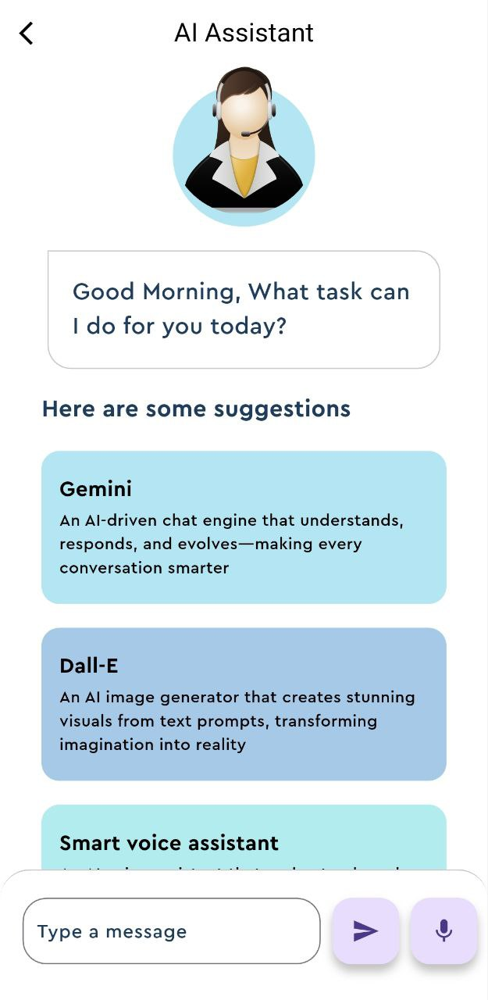

# 🧠 AI Voice Assistant App

A voice-powered AI assistant built with Flutter, powered by Google's Gemini API. Speak your queries — get spoken answers or AI-generated images.

## 🚀 Features

- 🎤 **Speech Recognition** (speech_to_text)
- 🧠 **Smart AI Responses** (Gemini Pro)
- 🎨 **AI Image Generation** (DALL·E-like)
- 🔊 **Text-to-Speech** (flutter_tts)
- 💡 **Clean and Animated UI**

## 📷 Screenshots



## 🛠️ Tech Stack

- Flutter
- Google Generative Language API (Gemini)
- flutter_tts
- speech_to_text
- HTTP API calls

## 🧰 Getting Started

### 1. Clone the repository

```bash
git clone https://github.com/mohamed0yaser/ai-Assistant.git
cd ai-Assistant
```

### 2. Add Your API Key

Create a `secrets.dart` file:

```dart
class Secrets {
  static const openAIAPIKey = 'YOUR_API_KEY';
}
```

> Get your API key from [Google Generative Language API](https://ai.google.dev)

### 3. Install dependencies

```bash
flutter pub get
```

### 4. Run the app

```bash
flutter run
```

## 📂 Structure

- `main.dart`: Entry point
- `homepage.dart`: Core UI and logic
- `openai_service.dart`: Handles Gemini & image generation APIs
- `feature_box.dart`: Reusable suggestion box widgets

## 🤖 Future Improvements

- Firebase integration for storing prompts
- Multi-language support
- Real-time chat history
- Push notifications

---

> Built with ❤️ using Flutter
